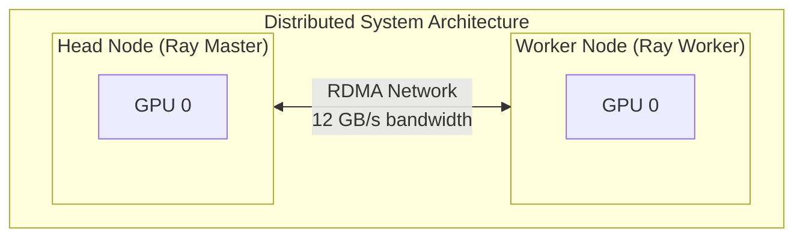
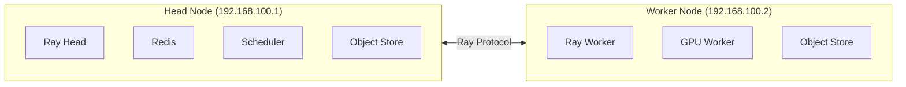
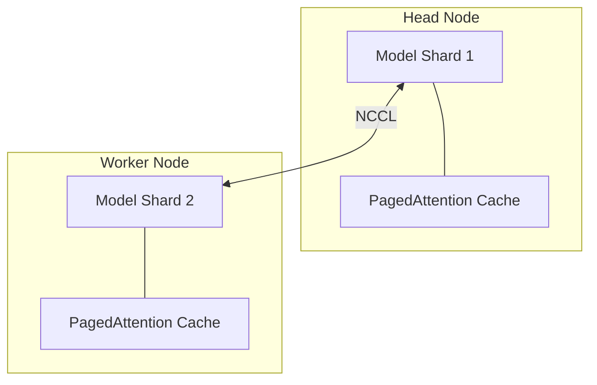
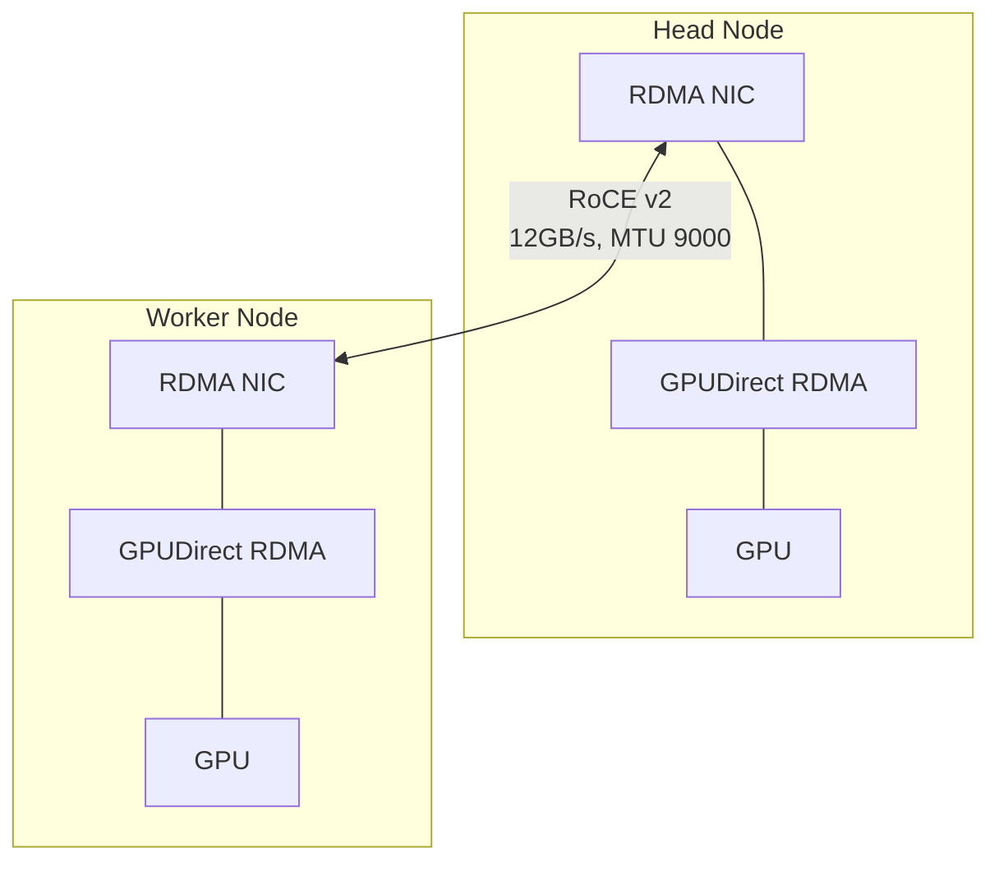
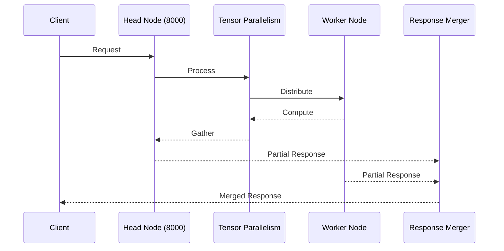
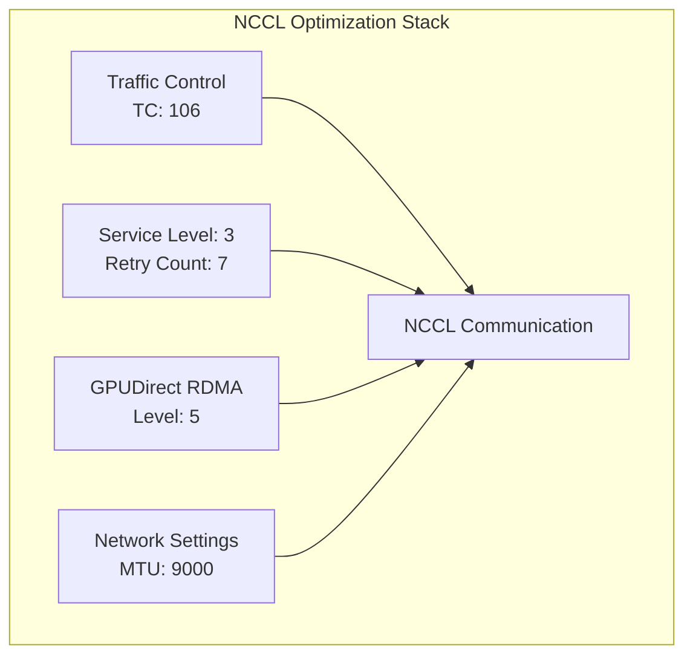
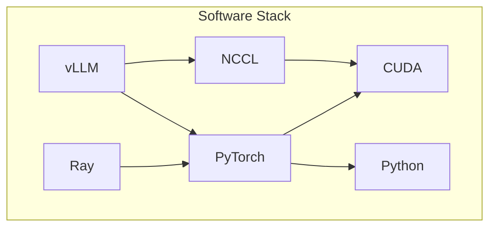

# Distributed Large Language Model Inference with Ray and vLLM

## Overview
This implementation provides a high-performance distributed inference setup for Large Language Models using Ray and vLLM, optimized with RDMA over Converged Ethernet (RoCE) for inter-node communication.



## Architecture Components

### 1. Ray Cluster
Ray provides the distributed computing framework, managing resources and coordinating model inference across nodes.



### 2. vLLM Integration
vLLM handles efficient LLM inference with:
- PagedAttention for optimized memory usage
- Tensor parallelism across GPUs
- Continuous batching for higher throughput



## Network Architecture

### RDMA Configuration
The setup uses RoCE v2 for high-speed inter-node communication:



## Model Configuration System

### 1. Registry (`./config/model_registry.yml`)
Central configuration for all supported models:

```yaml
models:
  gpt-oss-20b:
    model: openai/gpt-oss-20b
    dtype: bfloat16
    tensor-parallel-size: 2
    gpu-memory-utilization: 0.35
    max-num-seqs: 8
    max-model-len: 131072
    description: Lightweight
```

### 2. Python Launcher (`./config/launch.py`)
Robust model launching system with features:

- **Configuration Management**:
  - YAML parsing with error handling
  - Model settings validation
  - Smart CLI argument generation

- **User Experience**:
  - Dry-run capability (`--dry-run`)
  - Available models listing
  - Clear error messages
  - Pretty-printed output

- **Runtime Features**:
  - Signal handling (Ctrl+C support)
  - Environment variable configuration
  - Flexible parameter parsing

Usage:
```bash
# Launch a model
MODEL_NAME=gpt-oss-20b python launch.py

# Validate configuration
MODEL_NAME=gpt-oss-20b python launch.py --dry-run

# See available models
MODEL_NAME=invalid-model python launch.py
```

## Implementation Details

### 1. Head Node (`./head/`)
The head node serves as the Ray cluster manager and hosts the first model shard.

Key configurations:
```yaml
# From docker-compose.yml
services:
  ray-node:
    network_mode: host
    environment:
      - NCCL_IB_HCA=roceP2p1s0f0
      - NCCL_NET_GDR_LEVEL=5
```

### 2. Worker Node (`./worker/`)
Worker nodes connect to the head node and host additional model shards.

```yaml
# From docker-compose.yml
services:
  ray-node:
    environment:
      - RAY_ADDRESS=192.168.100.1:6379
      - VLLM_RAY_WORKER_ENV_VARS=NCCL_IB_DISABLE,NCCL_IB_HCA,...
```

### 3. Data Flow


## Performance Optimization

### 1. NCCL Settings


### 2. Memory Management
- Unlimited locked memory for RDMA operations
- Conservative GPU memory utilization (35%)
- Controlled sequence batching

## Network Requirements
- **Bandwidth**: 12+ GB/s inter-node
- **Latency**: < 10μs
- **MTU**: 9000 (Jumbo frames)
- **Network**: Dedicated RDMA subnet

## Hardware Requirements
As detailed in `multi_node_gpu_cluster_with_rdma/setup.md`:
- NVIDIA GPUs with GPUDirect RDMA support
- Mellanox ConnectX NICs or similar RDMA-capable NICs
- RoCE/InfiniBand interconnect
- CUDA 13.0+

## Software Stack


## Deployment Steps

1. **Network Setup**
   - Configure RDMA network as per `multi_node_gpu_cluster_with_rdma/setup.md`
   - Verify inter-node connectivity
   - Set proper MTU and network parameters

2. **Head Node**
   ```bash
   cd head
   cp .env.example .env
   # Edit .env with your settings
   docker-compose up -d
   ```

3. **Worker Node**
   ```bash
   cd worker
   cp .env.exmple .env
   # Edit .env with your settings
   docker-compose up -d
   ```

## Monitoring and Debugging

### 1. Log Streams
- Head node: `docker-compose logs -f`
- Worker node: `tail -f /tmp/ray/session_latest/logs/raylet.out`

### 2. Performance Metrics
```bash
# NCCL Tests
mpirun -np 2 -H 192.168.100.1,192.168.100.2 \
  /usr/local/nccl-tests/all_reduce_perf -b 8 -e 512M -f 2 -g 1
```

### 3. Health Checks
```bash
# RDMA Status
rdma link show

# GPU Status
nvidia-smi topo -m
```

## Troubleshooting

Common issues and solutions are documented in `multi_node_gpu_cluster_with_rdma/setup.md#troubleshooting`:
1. NCCL TCP fallback
2. Low bandwidth
3. Connection issues
4. GPU visibility problems

## Reference Documentation
- [Ray Documentation](https://docs.ray.io/)
- [vLLM Documentation](https://vllm.readthedocs.io/)
- [NCCL Documentation](https://docs.nvidia.com/deeplearning/nccl/)
- [GPUDirect RDMA](https://docs.nvidia.com/cuda/gpudirect-rdma/)

## Performance Expectations
- Large message bandwidth: ~12 GB/s
- Small message latency: < 10μs
- Model throughput: Dependent on model size and batch configuration
