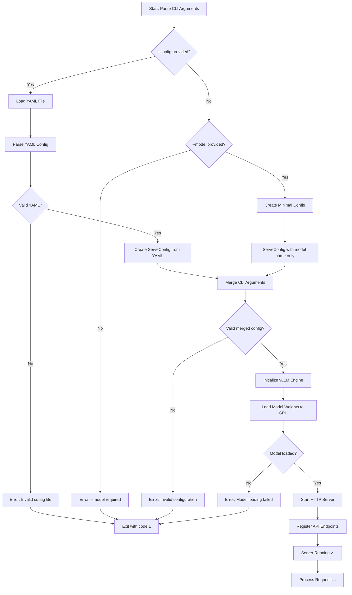

# vLLM Model Serving CLI

This directory contains the command-line interface for serving vLLM models with configurable parameters for GPU usage, server settings, and model configuration.

## Learning Guide: Understanding vLLM

This README and the accompanying source code are designed as educational resources to help you understand how vLLM works and how to optimize Large Language Model (LLM) inference.

### Core vLLM Concepts

**What is vLLM?**
vLLM is a high-performance inference engine for LLMs that uses several key optimizations:

- **PagedAttention** - Revolutionary memory management technique that treats attention computation like virtual memory paging, allowing non-contiguous memory blocks for KV cache
- **Continuous Batching** - Dynamically batches requests as they arrive, maximizing GPU utilization without waiting for batch completion
- **Efficient KV Cache Management** - Stores key-value pairs from attention layers efficiently, reducing redundant computation

**Why These Matter:**
- Traditional LLM serving wastes up to 60% of GPU memory on fragmented KV cache
- vLLM's PagedAttention achieves near-zero waste, enabling 2-4x higher throughput
- Continuous batching ensures GPUs stay busy, reducing latency

### GPU Memory Management

**Understanding GPU Memory in vLLM:**

```
Total GPU Memory (e.g., 24GB)
├── Model Weights (fixed, e.g., 13GB for 13B model)
├── KV Cache (dynamic, controlled by --gpu-memory)
├── Activation Memory (temporary during forward pass)
└── CUDA/System Overhead (~500MB-1GB)
```

**Key Parameters:**
- `--gpu-memory 0.9` - Allocates 90% of GPU to vLLM (KV cache + model weights)
- Higher memory = larger KV cache = more concurrent requests = better throughput
- Trade-off: Too high can cause OOM errors from CUDA overhead

**Tensor Parallelism (`--gpus 2`):**
- Splits model **layers** across multiple GPUs (not data parallelism)
- Each GPU holds 1/N of the model weights
- Requires inter-GPU communication for each layer
- Use when: Model weights + minimal KV cache > single GPU memory

### Model Precision and Quantization

**Data Types (`--dtype`):**

| Type | Bits | Memory | Speed | Quality | Use Case |
|------|------|--------|-------|---------|----------|
| float32 | 32 | 1x (baseline) | Slowest | Best | Research, debugging |
| float16 | 16 | 0.5x | Fast | Excellent | Older GPUs (pre-Ampere) |
| bfloat16 | 16 | 0.5x | Fastest | Excellent | Ampere+ GPUs (A100, RTX 30xx+) |

**Why bfloat16 is preferred:**
- Same range as float32 (wider than float16)
- Faster on modern GPU architectures
- Less prone to overflow/underflow than float16

**Quantization (`--quantization awq`):**
- Reduces weights to 4-bit precision (4x memory savings!)
- 13B model: ~26GB → ~7GB
- Enables running larger models on smaller GPUs
- Quality loss: typically <2% on benchmarks

**How AWQ Works:**
- **A**ctivation-**a**ware **W**eight **Q**uantization
- Preserves weights that matter most for important activations
- Better quality than naive quantization
- Must use pre-quantized models (TheBloke on HuggingFace)

### LLM Sampling and Generation

**Temperature (`--temperature`):**
- Controls randomness by scaling logits before softmax
- Formula: `probability = softmax(logits / temperature)`
- Low (0.1-0.3): Deterministic, factual (good for code, Q&A)
- High (1.2-2.0): Creative, diverse (good for stories, brainstorming)

**Top-p / Nucleus Sampling (`--top-p 0.9`):**
- Dynamically selects tokens until cumulative probability reaches p
- Prevents sampling from the "long tail" of unlikely tokens
- 0.9 = keep tokens that make up 90% of probability mass

**Top-k Sampling (`--top-k 40`):**
- Fixed cutoff: only consider top K most probable tokens
- Simpler than top-p but less adaptive
- Often used together with top-p

**Repetition Penalties:**
- `--presence-penalty`: Binary (-2 to 2) - penalize any token that appeared
- `--frequency-penalty`: Scaled (-2 to 2) - penalize proportional to count
- Prevents models from repeating phrases verbatim

### Context Length and Memory

**Understanding `--max-model-len`:**

The KV cache memory grows **linearly** with context length:
```
KV Cache Size = 2 × num_layers × hidden_size × sequence_length × batch_size × precision_bytes
```

**Example (Llama 13B):**
- 40 layers, 5120 hidden size, bfloat16 (2 bytes)
- Context 2048: ~1.6GB per request
- Context 4096: ~3.2GB per request (doubled!)
- Context 8192: ~6.4GB per request

**Trade-off:**
- Longer context = model can see more text = better coherence
- Longer context = less memory for batching = lower throughput
- **Never exceed model's trained context** or quality degrades

### vLLM Performance Optimization

**Throughput vs Latency:**
- **Throughput** (requests/sec): Maximize with high `--gpu-memory`, larger batches
- **Latency** (time per request): Minimize with lower context length, smaller batches
- vLLM optimizes for throughput via continuous batching

**When to Use What:**

| Scenario | GPU Memory | Context | Parallelism | Quantization |
|----------|-----------|---------|-------------|--------------|
| Small model, high throughput | 0.9 | 2048-4096 | 1 GPU | No |
| Large model, limited GPU | 0.9 | 2048 | 2 GPUs | Yes (AWQ) |
| Development/testing | 0.7 | 2048 | 1 GPU | No |
| Long context tasks | 0.9 | 8192+ | 2 GPUs | Maybe |

**The code in [serve_model.py](serve_model.py) contains extensive inline documentation explaining:**
- Practical implications of each parameter
- Memory calculations and trade-offs
- Performance tuning strategies
- Real-world configuration examples

## Overview

The CLI provides a comprehensive interface to start vLLM servers with support for:

- **Multi-GPU Configuration**: Single or dual GPU setups with tensor parallelism
- **Model Management**: HuggingFace models or local paths with trust-remote-code support
- **Server Configuration**: Host, port, and network binding options
- **Performance Tuning**: Tensor parallelism, quantization (AWQ/GPTQ), memory optimization
- **Generation Parameters**: Temperature, top-p/top-k sampling, penalties for controlling output
- **Configuration Files**: YAML-based configuration for complex setups with CLI override capability

## Key Features

### Two Configuration Modes

1. **Configuration File Mode** (Recommended for production)
   - Define all settings in a YAML file
   - Version-controlled, repeatable deployments
   - CLI arguments can override specific values

2. **Direct CLI Mode** (Quick testing)
   - Specify all parameters via command-line
   - Minimal setup with `--model` parameter
   - Ideal for experimentation and development

## Architecture

### Module Structure
- **`serve_model.py`** - Main CLI entry point with argument parsing and server initialization

### Workflow Overview

The serve model CLI follows a clear 6-step workflow:

1. **Argument Parsing** - Parse command-line arguments using Python's `argparse`
2. **Configuration Loading** - Load base config from YAML or create minimal config
3. **Validation** - Ensure required parameters are provided (model name)
4. **Configuration Merging** - Merge CLI arguments with base config (CLI overrides)
5. **Configuration Validation** - Validate the final merged configuration
6. **Server Startup** - Initialize vLLM engine and start HTTP server

### Dependencies

The CLI integrates with these internal modules:
- **`mixvllm.inference.config`** - Configuration management and validation
  - `ServeConfig` class for structured configuration
  - `from_yaml()` method for loading YAML files
  - `merge_cli_args()` method for merging CLI overrides
- **`mixvllm.inference.server`** - Server implementation
  - `start_server()` function that initializes vLLM and starts HTTP server

### Key Concepts

#### Configuration Modes
The CLI supports two distinct operating modes to accommodate different use cases:
- **Configuration File Mode**: Production-ready, version-controlled settings in YAML
- **Direct CLI Mode**: Quick testing and experimentation with minimal setup

#### Configuration Precedence
The system implements a clear hierarchy where CLI arguments always win:
```
CLI Args (highest) > YAML Config > Built-in Defaults (lowest)
```

#### Error Handling
The script implements robust error handling at each stage:
- Configuration loading errors → Exit code 1
- Validation errors → Exit code 1
- Server startup errors → Exit code 1
- Keyboard interrupt (Ctrl+C) → Exit code 0 (graceful shutdown)

## Usage

### Quick Start (Direct CLI Mode)

```bash
# Minimal: Just specify the model
uv run python mixvllm/cli/serve_model.py --model microsoft/Phi-3-mini-4k-instruct

# With trust-remote-code (required for Phi-3 and similar models)
uv run python mixvllm/cli/serve_model.py \
  --model microsoft/Phi-3-mini-4k-instruct \
  --trust-remote-code
```

### Configuration File Mode (Recommended)

```bash
# Load all settings from YAML
uv run python mixvllm/cli/serve_model.py --config configs/phi3-mini.yaml

# Load YAML and override specific values
uv run python mixvllm/cli/serve_model.py \
  --config configs/phi3-mini.yaml \
  --port 8080 \
  --temperature 0.9
```

### Example Configuration File

Create a YAML configuration file for complex setups:

```yaml
# configs/phi3-mini.yaml
model:
  name: microsoft/Phi-3-mini-4k-instruct
  trust_remote_code: true

inference:
  gpus: 2
  gpu_memory: 0.9
  max_model_len: 4096
  dtype: bfloat16

server:
  host: 0.0.0.0
  port: 8000

generation:
  temperature: 0.7
  max_tokens: 512
  top_p: 0.9
  top_k: 40
```

## Common Use Cases

### 1. Development Server (Local Only)
```bash
# Fast startup, localhost only, conservative memory
uv run python mixvllm/cli/serve_model.py \
  --model microsoft/Phi-3-mini-4k-instruct \
  --trust-remote-code \
  --host 127.0.0.1 \
  --port 8000 \
  --gpu-memory 0.7 \
  --max-model-len 2048
```

### 2. Production Server (Dual GPU)
```bash
# Optimized for throughput, accessible from network
uv run python mixvllm/cli/serve_model.py \
  --model microsoft/Phi-3-mini-4k-instruct \
  --trust-remote-code \
  --gpus 2 \
  --gpu-memory 0.9 \
  --max-model-len 4096 \
  --host 0.0.0.0 \
  --port 8000 \
  --temperature 0.7
```

### 3. Code Generation Server
```bash
# Low temperature for deterministic, factual outputs
uv run python mixvllm/cli/serve_model.py \
  --model codellama/CodeLlama-13b-hf \
  --temperature 0.2 \
  --top-p 0.95 \
  --max-tokens 1024 \
  --presence-penalty 0.1
```

### 4. Creative Writing Server
```bash
# Higher temperature for creative, diverse outputs
uv run python mixvllm/cli/serve_model.py \
  --model meta-llama/Llama-2-13b-chat-hf \
  --temperature 0.9 \
  --top-p 0.9 \
  --presence-penalty 0.6 \
  --frequency-penalty 0.3 \
  --max-tokens 2048
```

### 5. Quantized Model (Memory Efficient)
```bash
# Use AWQ quantization for 4x memory reduction
uv run python mixvllm/cli/serve_model.py \
  --model TheBloke/Llama-2-13B-chat-AWQ \
  --quantization awq \
  --gpu-memory 0.9 \
  --max-model-len 4096
```

### 6. Local Model Path
```bash
# Serve from a locally downloaded model
uv run python mixvllm/cli/serve_model.py \
  --model /path/to/local/model \
  --trust-remote-code \
  --dtype bfloat16
```

## Command Line Options

### Configuration File
- `--config PATH` - Load base configuration from YAML file
  - All other CLI arguments override values from this file
  - Example: `--config configs/phi3-mini.yaml`

### Model Options
- `--model NAME_OR_PATH` - **Required** if no `--config` provided
  - HuggingFace model ID: `microsoft/Phi-3-mini-4k-instruct`
  - Local path: `/path/to/model/directory`
- `--trust-remote-code` - Allow execution of custom model code
  - Required for models like Phi-3 with custom implementations
  - **Security warning**: Only use with trusted models

### Inference Configuration

#### GPU Settings
- `--gpus {1,2}` - Number of GPUs for tensor parallelism
  - `1`: Single GPU (simpler, no communication overhead)
  - `2`: Split model across 2 GPUs (for larger models)
- `--gpu-memory FRACTION` - GPU memory utilization (0.1-1.0)
  - `0.9`: Recommended default (90%, leaves room for CUDA)
  - `0.7-0.8`: Safe when running other GPU processes
  - `1.0`: Maximum performance, risk of OOM errors
  - Higher values = larger KV cache = better throughput

#### Model Configuration
- `--max-model-len TOKENS` - Maximum context length
  - Cannot exceed model's trained context window
  - Longer context = more GPU memory required
  - Examples: `2048` (small), `4096` (standard), `8192+` (long)
- `--dtype TYPE` - Data type for model weights
  - `float32`: Full precision (most memory, highest quality)
  - `float16`: Half precision (good balance)
  - `bfloat16`: Brain float16 (recommended for Ampere+ GPUs)
  - `auto`: Let vLLM choose based on model config
- `--quantization METHOD` - Weight quantization for smaller memory footprint
  - `awq`: Activation-aware Weight Quantization
  - `gptq`: GPT Quantization
  - `null` or omit: No quantization
  - Benefits: 4x smaller memory, faster inference, <2% quality loss
  - **Note**: Model must be pre-quantized in specified format

### Server Settings
- `--host ADDRESS` - Network interface to bind (default: `0.0.0.0`)
  - `0.0.0.0`: Listen on all interfaces (accessible from network)
  - `127.0.0.1`: Localhost only (secure for development)
  - **Security**: Be careful with `0.0.0.0` on public networks
- `--port NUMBER` - TCP port number (default: `8000`)
  - Valid range: 1024-65535
  - Common choices: `8000`, `8080`

### Generation Defaults
These parameters control text generation behavior and can be overridden per-request via API.

#### Sampling Parameters
- `--temperature FLOAT` - Controls randomness (0.0-2.0)
  - `0.0`: Deterministic (greedy decoding)
  - `0.7`: Balanced creativity (good default)
  - `1.0`: Unmodified probabilities
  - `1.5+`: Very creative, potentially incoherent
  - **Use low (0.1-0.3)** for: factual tasks, code generation
  - **Use medium (0.7-1.0)** for: creative writing, conversations
  - **Use high (1.2-2.0)** for: experimental creative outputs

- `--max-tokens INTEGER` - Maximum tokens to generate
  - Limits response length (1 token ≈ 0.75 words)
  - Prevents runaway generation
  - Examples: `100-200` (short), `500-1000` (medium), `2000+` (long)

- `--top-p FLOAT` - Nucleus sampling (0.0-1.0)
  - Considers only tokens with cumulative probability ≤ p
  - `0.9`: Consider top 90% probability mass (good default)
  - `1.0`: No filtering
  - `0.5`: Very conservative
  - **Tip**: Use top-p OR temperature, not both aggressively

- `--top-k INTEGER` - Limit to k most probable tokens
  - `40-50`: Balanced (common default)
  - `1`: Greedy (most probable only)
  - `100+`: More diverse
  - **Difference from top-p**: Fixed count vs probability-based

#### Repetition Control
- `--presence-penalty FLOAT` - Penalize tokens that appeared (-2.0 to 2.0)
  - Positive: Encourages new topics, reduces repetition
  - `0.0`: No penalty (default)
  - Negative: Encourages staying on topic
  - Binary: Only cares IF token appeared (not how many times)

- `--frequency-penalty FLOAT` - Penalize based on occurrence count (-2.0 to 2.0)
  - Positive: Reduces repetition proportional to frequency
  - `0.0`: No penalty (default)
  - Scales with frequency: stronger for oft-repeated tokens
  - **Use for**: Preventing word/phrase repetition in long text

## How Configuration Works

The CLI implements a hierarchical configuration system with clear precedence:

### Configuration Hierarchy (Highest to Lowest Priority)

1. **CLI Arguments** - Always override everything
2. **YAML Config File** - Base configuration
3. **Built-in Defaults** - Fallback values

### Configuration Flow Diagram



### Example: Configuration Override

```yaml
# base_config.yaml
model:
  name: microsoft/Phi-3-mini-4k-instruct
server:
  port: 8000
generation:
  temperature: 0.7
```

```bash
# CLI overrides port and temperature
uv run python mixvllm/cli/serve_model.py \
  --config base_config.yaml \
  --port 9000 \
  --temperature 0.9

# Final configuration:
# - model: microsoft/Phi-3-mini-4k-instruct (from YAML)
# - port: 9000 (CLI override)
# - temperature: 0.9 (CLI override)
```

### Server Architecture

```mermaid
graph LR
    A[CLI Entry Point] --> B[Argument Parser]
    B --> C[Config Loader]
    C --> D[ServeConfig Object]
    D --> E[vLLM Engine]
    E --> F[Model Weights]
    E --> G[HTTP Server]
    G --> H[API Endpoints]
    H --> I[/v1/completions]
    H --> J[/v1/chat/completions]
    H --> K[/health]
```

## Integration

After starting the server, you can interact with it via HTTP API or chat client:

### HTTP API
```bash
# Start server
uv run python mixvllm/cli/serve_model.py \
  --model microsoft/Phi-3-mini-4k-instruct \
  --trust-remote-code

# Test with curl
curl http://localhost:8000/v1/completions \
  -H "Content-Type: application/json" \
  -d '{
    "model": "microsoft/Phi-3-mini-4k-instruct",
    "prompt": "Once upon a time",
    "max_tokens": 100
  }'
```

### Chat Client
```bash
# Start server in one terminal
uv run python mixvllm/cli/serve_model.py \
  --config configs/phi3-mini.yaml

# In another terminal, start chat client
uv run mixvllm-chat --enable-mcp --mcp-config configs/mcp_servers.yaml
```

## Troubleshooting

### Common Issues

#### 1. `--model is required when not using --config`
**Problem**: You didn't provide either `--config` or `--model`.

**Solution**:
```bash
# Provide model name
uv run python mixvllm/cli/serve_model.py --model microsoft/Phi-3-mini-4k-instruct

# OR provide config file
uv run python mixvllm/cli/serve_model.py --config configs/phi3-mini.yaml
```

#### 2. GPU Out of Memory (OOM)
**Problem**: Model too large for available GPU memory.

**Solutions**:
```bash
# Reduce GPU memory utilization
--gpu-memory 0.7

# Reduce context length
--max-model-len 2048

# Use quantization (if model supports it)
--quantization awq

# Use tensor parallelism across 2 GPUs
--gpus 2
```

#### 3. Port Already in Use
**Problem**: Another process is using the port.

**Solutions**:
```bash
# Use a different port
--port 8080

# Or find and kill the process using the port
lsof -ti:8000 | xargs kill -9
```

#### 4. Trust Remote Code Error
**Problem**: Model requires custom code but `--trust-remote-code` not provided.

**Solution**:
```bash
# Add the flag (only for trusted models!)
--trust-remote-code
```

#### 5. Slow Inference
**Problem**: Generation is taking too long.

**Solutions**:
```bash
# Increase GPU memory for larger KV cache
--gpu-memory 0.9

# Use bfloat16 for faster compute (Ampere+ GPUs)
--dtype bfloat16

# Reduce context length
--max-model-len 2048

# Use quantized model
--quantization awq
```

## Best Practices

### Development
- Use `--host 127.0.0.1` for security (localhost only)
- Start with `--gpu-memory 0.7` to leave room for other processes
- Use short context length (`--max-model-len 2048`) for faster iteration

### Production
- Use YAML config files for version control and repeatability
- Set `--gpu-memory 0.9` for maximum throughput
- Use `--gpus 2` for larger models
- Consider quantization for memory efficiency
- Monitor and tune generation parameters based on use case

### Security
- Never use `--trust-remote-code` with untrusted models
- Use `--host 127.0.0.1` for local-only access
- Use `--host 0.0.0.0` only with proper firewall rules
- Validate all models before deployment

## Examples

See the `configs/` directory for example configuration files:
- `phi3-mini.yaml` - Phi-3 mini model configuration
- `llama-70b-tp2.yaml` - LLaMA 70B with tensor parallelism
- `gpt-oss-20b.yaml` - GPT OSS model configuration