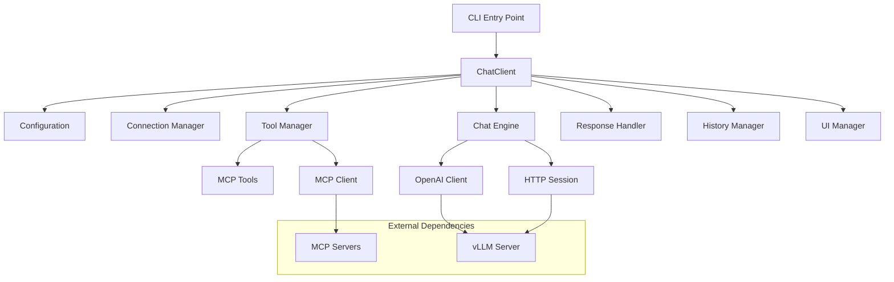
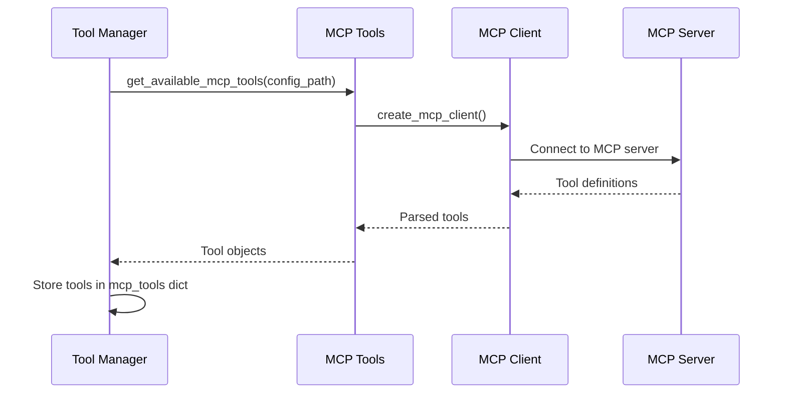
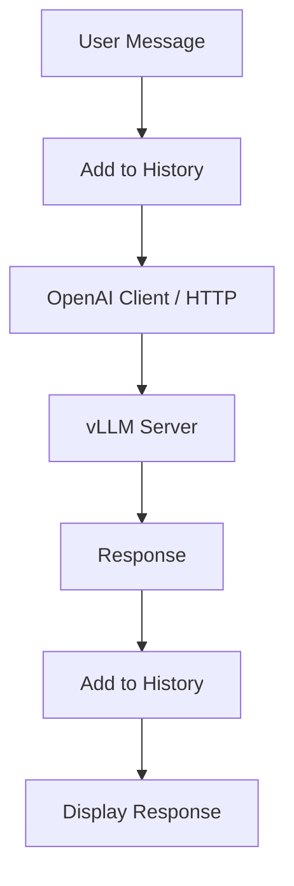
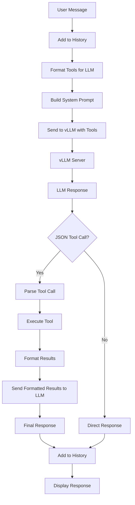
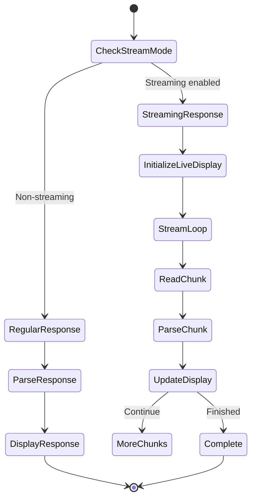
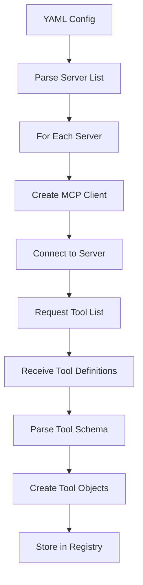
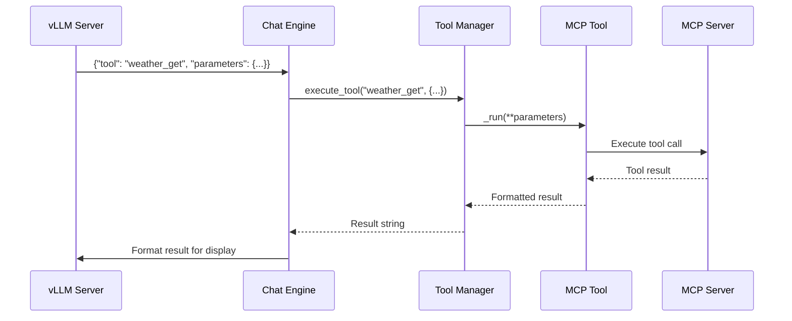
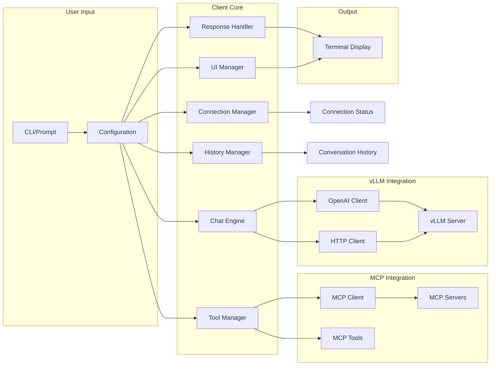

# Chat Client - Developer Documentation

This document provides detailed technical information about the chat client's MCP (Model Context Protocol) implementation, internal architecture, and data flows.

## Learning Guide: Understanding the Chat Client

This client demonstrates several important concepts in building LLM chat applications:

### Key Learning Areas

**1. LLM Client Architecture**
- **Modular design**: Separation of concerns (networking, UI, logic)
- **Configuration management**: Centralized settings with dataclasses
- **Error handling**: Graceful degradation and user-friendly messages

**2. OpenAI API Compatibility**
- **Why vLLM uses OpenAI's API**: Industry standard, wide ecosystem support
- **Benefits**: Drop-in replacement for OpenAI, use existing SDKs
- **Endpoints**: `/v1/chat/completions`, `/v1/models`, `/health`

**3. HTTP Communication Patterns**
- **Connection pooling**: Reusing TCP connections for performance
- **Streaming vs non-streaming**: Trade-offs in latency and UX
- **Error handling**: Network errors, timeouts, malformed responses

**4. Model Context Protocol (MCP)**
- **Tool calling**: Enabling LLMs to interact with external systems
- **Two-phase prompting**: Tool selection → Tool execution → Result formatting
- **JSON-based communication**: Structured data exchange with LLM

**5. Conversation Management**
- **Context window**: Managing conversation history within token limits
- **Message roles**: System, user, assistant for proper prompting
- **History tracking**: Maintaining conversational context

### Core Design Patterns

**Factory Pattern** (`config.py`)
- `ChatConfig.from_args()` creates config from different sources
- Enables flexible construction without changing the class

**Manager Pattern** (all `*_manager.py` files)
- Encapsulates related functionality (tools, history, UI, connections)
- Single responsibility principle: each manager has one job

**Strategy Pattern** (`chat_engine.py`)
- `_chat_direct()` vs `_chat_with_mcp_tools()` - different chat strategies
- Switches between strategies based on configuration

**Dependency Injection**
- Components receive dependencies via constructor
- Enables testing and modularity

### HTTP Connection Pooling

**Why it matters:**
```python
# Without pooling (slow):
for i in range(10):
    requests.get(url)  # New TCP connection each time: 10 x 50ms = 500ms

# With pooling (fast):
session = requests.Session()
for i in range(10):
    session.get(url)  # Reuse connection: 50ms + 9 x 5ms = 95ms
```

**Implementation:**
- `ConnectionManager` uses `requests.Session()`
- Session maintains connection pool automatically
- 5-10x faster for multiple requests

### Streaming Responses

**How streaming works:**
```
Client ──────────────────────────► vLLM Server
       ← token ← token ← token ← token ←

Display updates as each token arrives (real-time)
```

**Without streaming:**
```
Client ──────────────────────────► vLLM Server
       ← [wait 10 seconds] ← full response ←

User waits for entire response before seeing anything
```

**Trade-offs:**
- Streaming: Better perceived latency, more complex code
- Non-streaming: Simpler code, worse user experience for long responses

### MCP Tool Calling Flow

**Phase 1: Tool Selection**
```
User: "What's the weather in San Francisco?"
   ↓
LLM receives:
- System prompt describing available tools
- Tool: weather_get(city: str) -> str
- User query
   ↓
LLM responds: {"tool": "weather_get", "parameters": {"city": "San Francisco"}}
```

**Phase 2: Tool Execution**
```
Parse JSON → Extract tool_name and params
   ↓
Execute: weather_get(city="San Francisco")
   ↓
Result: "72°F, sunny, 10 mph winds"
```

**Phase 3: Result Formatting**
```
Send to LLM:
- Tool name: weather_get
- Parameters: {"city": "San Francisco"}
- Raw result: "72°F, sunny, 10 mph winds"
   ↓
LLM formats nicely:
"The weather in San Francisco is currently 72°F and sunny,
with light winds at 10 mph. Great day for outdoor activities!"
```

### OpenAI Client vs HTTP Requests

**This client supports both methods:**

| Aspect | OpenAI Client | HTTP Requests |
|--------|--------------|---------------|
| Ease of use | ✅ High-level, intuitive | ⚠️ Manual JSON handling |
| Streaming | ✅ Built-in support | ⚠️ Manual SSE parsing |
| Error handling | ✅ Typed exceptions | ⚠️ Generic HTTP errors |
| Dependencies | ⚠️ Requires openai package | ✅ Only requests needed |
| Compatibility | ✅ Works with any OpenAI-compatible API | ✅ Universal |

**Why support both:**
- OpenAI client: Better DX when available
- HTTP fallback: Works in constrained environments
- Demonstrates both approaches for learning

## Architecture Overview

The chat client implements a modular architecture with clear separation of concerns, enabling robust MCP tool integration with vLLM servers.



## Core Components

### Configuration (`config.py`)

**Purpose**: Centralized configuration management with validation.

**Key Features**:
- Dataclass-based configuration with type hints
- Automatic URL normalization
- Default value management
- CLI argument conversion

```python
@dataclass
class ChatConfig:
    base_url: str = "http://localhost:8000"
    model: Optional[str] = None
    enable_mcp: bool = False
    debug: bool = False
    mcp_config_path: Optional[str] = None
    temperature: float = 0.7
    max_tokens: int = 512
    stream: bool = False
```

### Connection Manager (`connection_manager.py`)

**Purpose**: Handles vLLM server connectivity and model discovery.

**Key Methods**:
- `test_connection()`: Health check via `/health` endpoint
- `get_available_models()`: Fetches models from `/v1/models`

**Libraries Used**:
- `requests.Session`: HTTP connection pooling
- `rich.console.Console`: Status display

### Tool Manager (`tool_manager.py`)

**Purpose**: Manages MCP tool lifecycle and execution.

**MCP Integration Flow**:



**Key Features**:
- Dynamic tool loading from YAML configuration
- Tool validation and error handling
- Direct tool execution with parameter passing

### Chat Engine (`chat_engine.py`)

**Purpose**: Core chat logic handling both direct and MCP-enhanced conversations.

**Two-Mode Architecture**:

#### Direct Chat Mode


#### MCP Chat Mode


**Libraries Used**:
- `openai.OpenAI`: Official OpenAI client for vLLM API
- `requests.Session`: Fallback HTTP client
- `json`: Tool call parsing

### Response Handler (`response_handler.py`)

**Purpose**: Processes different response types (regular vs streaming).

**Streaming Implementation**:



**Key Features**:
- Rich live display for streaming responses
- Markdown rendering support
- Error handling for malformed responses

### History Manager (`history_manager.py`)

**Purpose**: Manages conversation context and history display.

**Data Structure**:
```python
conversation_history: List[Dict[str, str]] = [
    {"role": "user", "content": "Hello"},
    {"role": "assistant", "content": "Hi there!"},
    # ...
]
```

### UI Manager (`ui_manager.py`)

**Purpose**: Handles all user interface elements and formatting.

**Rich Integration**:
- `rich.console.Console`: Main display interface
- `rich.panel.Panel`: Content framing
- `rich.table.Table`: Structured data display
- `rich.markdown.Markdown`: Rich text rendering
- `rich.live.Live`: Streaming display updates

## MCP Protocol Implementation

### Tool Discovery Process



### Tool Execution Flow



### Configuration Format

```yaml
# configs/mcp_servers.yaml
servers:
  weather:
    command: "python"
    args: ["-m", "mcp_server_weather"]
    env:
      API_KEY: "${WEATHER_API_KEY}"
  filesystem:
    command: "npx"
    args: ["-y", "@modelcontextprotocol/server-filesystem", "/tmp"]
```

## Libraries and Dependencies

### Core Dependencies

- **`openai>=2.2.0`**: Official OpenAI client for vLLM API compatibility
- **`requests>=2.25.0`**: HTTP client for direct API calls
- **`rich>=13.0.0`**: Terminal UI and formatting
- **`prompt_toolkit>=3.0.0`**: Enhanced command-line input
- **`pyyaml>=6.0`**: Configuration file parsing

### MCP-Specific Libraries

- **Custom MCP Client**: `mixvllm.client.utils.mcp_client`
  - Handles MCP protocol communication
  - Server connection management
  - Tool definition parsing

- **MCP Tools**: `mixvllm.client.utils.mcp_tools`
  - Tool registry and discovery
  - LangChain-compatible tool wrappers
  - Parameter validation

### Internal Data Flow



## Error Handling

### Connection Errors
- Automatic fallback from OpenAI client to HTTP requests
- Graceful degradation when MCP servers are unavailable
- User-friendly error messages with Rich formatting

### Tool Execution Errors
- Tool-specific error handling
- Result formatting even when tools fail
- Debug logging for troubleshooting

### Streaming Errors
- Robust chunk parsing with error recovery
- Display state management during failures
- Clean termination of streaming sessions

## Performance Considerations

### Connection Pooling
- `requests.Session` for HTTP connection reuse
- Persistent OpenAI client instances

### Memory Management
- Streaming responses to handle large outputs
- Conversation history truncation for long sessions

### Caching
- MCP tool discovery caching
- Model information caching

## Testing and Debugging

### Debug Mode
Enable with `--debug` flag for detailed logging:
- LLM prompts and responses
- Tool execution details
- HTTP request/response logging

### Component Isolation
Each component can be tested independently:
- `config.py`: Configuration validation
- `tool_manager.py`: MCP tool loading
- `chat_engine.py`: Chat logic
- `response_handler.py`: Response processing

## Future Extensions

### Additional MCP Tools
- File system operations
- Database queries
- API integrations

### Enhanced UI
- Web-based interface
- GUI applications
- API endpoints

### Advanced Features
- Conversation persistence
- Multi-model support
- Custom tool development framework