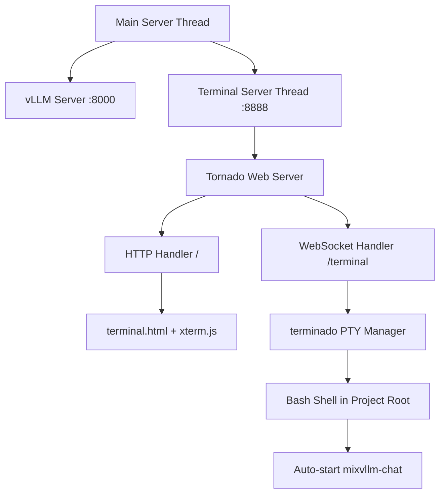

# mixvllm/inference - Server/Inference Developer Documentation

## Overview

The `mixvllm/inference` package provides a comprehensive wrapper around vLLM for GPU-accelerated model serving. It implements a robust configuration system, server lifecycle management, and seamless integration with the CLI interface.

## Architecture

```
mixvllm/inference/
├── config.py          # Pydantic configuration models
├── server.py          # vLLM server wrapper & lifecycle
├── utils.py           # Configuration utilities & GPU detection
├── terminal_server.py # Web terminal server (optional)
└── static/
    └── terminal.html  # xterm.js frontend for web terminal
```

## Core Components

### Configuration System (`config.py`)

The configuration system uses Pydantic for type-safe, validated configuration management.

#### ServeConfig Model

```python
class ServeConfig(BaseModel):
    model: ModelConfig
    inference: InferenceConfig
    server: ServerConfig
    generation_defaults: GenerationDefaultsConfig
```

#### Key Configuration Classes

**ModelConfig**: Defines model-specific settings
- `name`: Model identifier (HuggingFace path or local path)
- `trust_remote_code`: Allow execution of remote code in model files

**InferenceConfig**: Controls inference behavior
- `tensor_parallel_size`: Number of GPUs for tensor parallelism
- `gpu_memory_utilization`: Memory utilization per GPU (0.0-1.0)
- `max_model_len`: Maximum sequence length
- `dtype`: Data type for model weights
- `quantization`: Quantization method (e.g., "awq", "gptq")

**ServerConfig**: Network and serving settings
- `host`: Server bind address
- `port`: Server port
- `workers`: Number of worker processes

**TerminalConfig**: Web terminal settings (optional)
- `enabled`: Enable web terminal interface
- `host`: Terminal server bind address
- `port`: Terminal server port (default: 8888)
- `auto_start_chat`: Auto-launch mixvllm-chat on connection

**GenerationDefaultsConfig**: Default generation parameters
- `temperature`: Sampling temperature
- `max_tokens`: Maximum tokens to generate
- `top_p`: Nucleus sampling parameter
- `top_k`: Top-k sampling parameter
- `presence_penalty`: Presence penalty
- `frequency_penalty`: Frequency penalty

### Server Lifecycle Management (`server.py`)

#### Server Process Management

The server uses subprocess management to start and stop vLLM servers:

```python
def start_server(config: ServeConfig) -> subprocess.Popen:
    """Start vLLM server with given configuration."""
    cmd = build_vllm_command(config)
    return subprocess.Popen(cmd, stdout=PIPE, stderr=PIPE)
```

#### Command Building

The `build_vllm_command` function constructs the vLLM CLI command:

```python
def build_vllm_command(config: ServeConfig) -> List[str]:
    cmd = ["python", "-m", "vllm.entrypoints.openai.api_server"]
    # Add model arguments
    cmd.extend(["--model", config.model.name])
    # Add inference arguments
    cmd.extend(["--tensor-parallel-size", str(config.inference.tensor_parallel_size)])
    # ... additional arguments
    return cmd
```

#### Server Control Flow


### Configuration Utilities (`utils.py`)

#### YAML Configuration Loading

```python
def load_yaml_config(yaml_path: str) -> Dict[str, Any]:
    """Load configuration from YAML file with validation."""
    with open(yaml_path, 'r') as f:
        data = yaml.safe_load(f)
    return data
```

#### Configuration Merging

The `merge_configs` function provides CLI override capability:

```python
def merge_configs(base_config: ServeConfig, cli_args: Dict[str, Any]) -> ServeConfig:
    """Merge CLI arguments into base configuration."""
    # Maps CLI arg names to config paths
    arg_mapping = {
        'model': 'model.name',
        'gpus': 'inference.tensor_parallel_size',
        'gpu_memory': 'inference.gpu_memory_utilization',
        # ... additional mappings
    }
    # Apply overrides and return new config
```

#### GPU Detection

```python
def get_gpu_info() -> Dict[str, Any]:
    """Get comprehensive GPU information using PyTorch."""
    try:
        import torch
        gpu_count = torch.cuda.device_count()
        gpus = []
        for i in range(gpu_count):
            props = torch.cuda.get_device_properties(i)
            gpus.append({
                'id': i,
                'name': props.name,
                'total_memory_gb': round(props.total_memory / 1024**3, 1),
            })
        return {
            'gpu_count': gpu_count,
            'gpus': gpus,
            'cuda_available': torch.cuda.is_available(),
        }
    except ImportError:
        return {'gpu_count': 0, 'gpus': [], 'cuda_available': False}
```

## Data Flow Architecture

### Configuration Loading Flow


### Server Startup Sequence


## CLI Integration

The inference package integrates with the CLI through the `serve_model.py` script:

```python
# Key integration points
config = load_config_from_yaml(args.config)
merged_config = merge_serve_config_with_cli(config, vars(args))
server_process = start_server(merged_config)
```

## Error Handling

### Configuration Validation
- Pydantic automatically validates configuration values
- Type checking prevents invalid parameter types
- Custom validators ensure logical constraints (e.g., memory utilization 0.0-1.0)

### Server Startup Errors
- Process startup failures are caught and logged
- GPU availability is checked before server start
- Subprocess output is monitored for error conditions

### GPU Detection Fallback
- Graceful degradation when PyTorch unavailable
- Returns empty GPU list with cuda_available=False
- Allows server to run in CPU-only mode

## Performance Considerations

### Memory Management
- `gpu_memory_utilization` controls VRAM usage
- Tensor parallelism distributes model across GPUs
- `max_model_len` affects memory requirements

### Process Management
- Subprocess isolation prevents main process blocking
- stdout/stderr capture enables logging
- Proper cleanup on shutdown

## Testing Strategy

### Configuration Testing
- Pydantic model validation testing
- YAML loading edge cases
- CLI argument merging validation

### Server Testing
- Mock subprocess testing
- GPU detection mocking
- Command building verification

### Integration Testing
- End-to-end server startup
- Configuration override testing
- Error condition handling

## Dependencies

- `pydantic`: Configuration validation and serialization
- `pyyaml`: YAML configuration file parsing
- `torch`: GPU detection and information gathering
- `vllm`: Model serving backend (runtime dependency)
- `terminado`: PTY management for web terminal (optional)
- `tornado`: Async web server for terminal WebSockets (optional)

## Web Terminal Feature (`terminal_server.py`)

### Overview

The web terminal provides browser-based access to CLI tools via xterm.js and WebSocket connections. It runs independently on a separate port and thread from the main model server.

### Architecture



### Key Components

**TerminalPageHandler**: Serves the HTML page with xterm.js frontend
```python
class TerminalPageHandler(tornado.web.RequestHandler):
    def get(self):
        # Load and serve terminal.html with configuration variables
        # Replaces {{MODEL_SERVER_URL}} and {{AUTO_START_CHAT}}
```

**Tornado Application**: Routes and WebSocket management
```python
def create_terminal_app(config, model_server_url, project_root):
    # Create terminado manager with bash shell
    # Configure routes for HTTP and WebSocket
    # Return configured Tornado application
```

**Terminal Server Lifecycle**: Runs in separate thread
```python
def start_terminal_server(config, model_server_url, project_root):
    # Create Tornado application
    # Start listening on terminal port
    # Run event loop (blocking in thread)
```

### Integration with Main Server

The terminal server is optionally started alongside the vLLM server:

```python
# In server.py
if config.terminal.enabled:
    terminal_thread = start_terminal_server_thread(config, project_root)
```

### Terminal Manager

Uses terminado's `UniqueTermManager` with custom working directory:

```python
class CustomTermManager(UniqueTermManager):
    def new_terminal(self, **kwargs):
        kwargs['cwd'] = project_root  # Start in project root
        return super().new_terminal(**kwargs)
```

### Frontend (terminal.html)

- **xterm.js**: Professional terminal emulator loaded via CDN
- **WebSocket Connection**: Bidirectional communication with PTY
- **Auto-start**: Optionally sends command to start mixvllm-chat
- **Responsive Design**: Terminal fills viewport with proper sizing

### Security Model

⚠️ **No Authentication**: The terminal provides full shell access without authentication

**Current State**:
- Open access to anyone who can reach the port
- Same permissions as server process
- Suitable for trusted/development environments only

**Recommendations**:
- Use behind VPN or firewall
- Enable only when needed
- Consider SSH port forwarding for remote access
- Future: Add authentication middleware

### Configuration Flow

```yaml
# YAML config
terminal:
  enabled: true
  host: "0.0.0.0"
  port: 8888
  auto_start_chat: true
```

↓

```python
# Pydantic validation
class TerminalConfig(BaseModel):
    enabled: bool = False
    host: str = "0.0.0.0"
    port: int = 8888
    auto_start_chat: bool = True
```

↓

```python
# CLI override
--enable-terminal --terminal-port 9000
```

### Error Handling

**Connection Failures**:
- PTY spawn failures logged to console
- WebSocket errors sent to browser console
- Connection closed message displayed to user

**Port Conflicts**:
- Tornado will raise exception if port unavailable
- Server continues without terminal (non-fatal)

### Performance Characteristics

- **Minimal Overhead**: Terminal runs in separate thread
- **No Impact on Model Serving**: Independent from vLLM process
- **WebSocket Efficiency**: Binary PTY data over persistent connection
- **Multiple Terminals**: Supports up to 10 concurrent terminal sessions

### Development Notes

**Dependencies**:
- terminado ≥0.18.0 for PTY management
- tornado ≥6.4.0 for async web + WebSocket
- xterm.js 5.3.0+ loaded from CDN (no build step)

**Testing Considerations**:
- Mock terminado for unit tests
- Test WebSocket lifecycle (connect, data, close)
- Verify PTY working directory configuration
- Test concurrent terminal sessions

**Known Limitations**:
- No session persistence (terminals lost on server restart)
- No authentication/authorization
- No recording/playback of terminal sessions
- Shell command is bash-only (not configurable per-user)

## Future Enhancements

### Configuration Features
- Environment variable support
- Configuration profiles
- Dynamic configuration reloading

### Server Features
- Health check endpoints
- Metrics collection
- Graceful shutdown handling

### Monitoring
- GPU utilization tracking
- Performance metrics
- Error rate monitoring